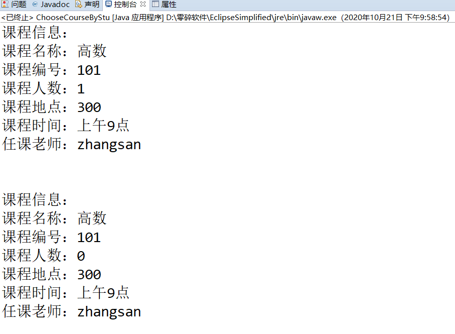

# 练习三 学生选课系统 计G202王飞2020322115

## 一、实验目的

掌握面向对象的类设计方法。
掌握类的继承用法，用过构造方法实例化对象。
运用super();继承，用于实例化子类
掌握使用toString()方法，应用在相关对象的信息输出中。

## 二、实验要求
实验三中有人员、教师、学生、课程、选课系统，5个类，教师教授课程，学生选择课程，由业务要求简化系统，每名教师仅教授一门课程，每门课程的授课教师也仅有以为，每名学生选仅选一门课程。人员类里面有教师和学生的共同属性，教师类继承人员类属性，额外有所授课程属性。学生类继承人员类属性，额外有所选课程属性。

## 三、实验流程


## 四、核心代码

```Java
	@Override
	public String toString() {
		return "课程信息：\n"
				+ "课程名称："+getName()+"\n"
				+ "课程编号："+getId()+"\n"
				+ "课程人数："+students.size()+"\n"
				+ "课程地点："+getRoom()+"\n"
				+ "课程时间："+getcTime()+"\n"
				+ "任课老师："+getTeacher().getName()+"\n\n";
	}

```

```Java
public class Student extends Renyuan {
	private Course course;

	/**
	 * @param id
	 * @param name
	 * @param sex
	 * @param course
	 */
	public Student(String id, String name, String sex) {
		super(id, name, sex);
	}

	public Course getCourse() {
		return course;
	}

	public void setCourse(Course course) {
		this.course = course;
	}

	private String getCourseName() {
		if (course != null) {
			return course.getName();
		}
		return "无课程";
	}

```

## 五、实验结果


## 六、实验感想
在热心同学的大力帮助下，我艰难的完成了这次的学生选课系统，在完成练习三的过程中，重温了下@Override的覆盖概念。以及super();的继承，在课程类里面判断课程和学生类的过程中出现了JAVA语句不会的问题，下次尽量不在线查JAVA语句，另外用到了类型ArrayList，ArrayList是集合，在定义ArrayList类型变量时，后面的<>中定义泛型，就是用来定义集合中每一个元素的类型，代码中的students对象的每一个元素都是Student类型的对象。类似一个集合，但比集合要难理解一些。不定义程序就会有错误，不过结果不会改变，可能是不定义它的话，元素的类型就为Object吧。
